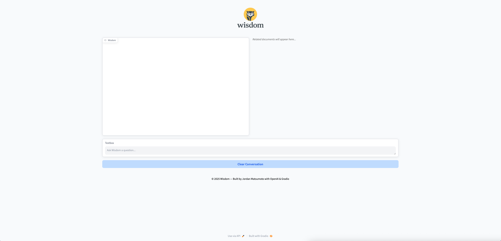
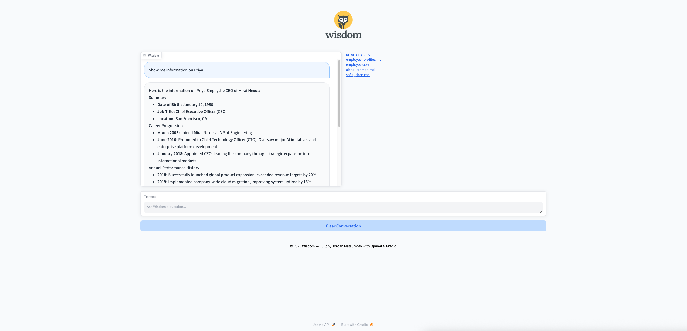
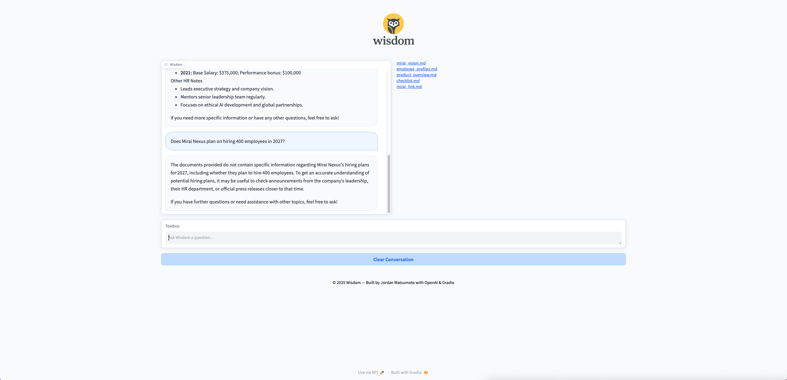

# Wisdom

Wisdom is an AI-powered knowledge base assistant built with Python, Gradio, ChromaDB, and OpenAI. Wisdom uses Retrieval-Augmented Generation (RAG) to answer questions by retrieving relevant document content and generating context-aware answers. Related source documents are displayed as clickable links for full transparency. This project demonstrates vector-based retrieval, LLM integration, and an interactive UI.

## Screenshots

  
*Ask questions and get answers from your document knowledge base through a sleek Gradio interface.*

## Demo

### 1. Ask a Document-Related Question
**Prompt:**  
> Show me information on Priya.

**Result:**  
  
*Wisdom returns a contextual answer based on your knowledge base, highlighting the retrieval-augmented generation (RAG) process from your documents.*

### 2. Ask a Generic Question
**Prompt:**  
> Does Mirai Nexus plan on hiring 400 employees in 2027?

**Result:**  
  
*Wisdom responds based on its language model knowledge, showing that it can answer questions even when the documents don’t contain the information.*

## Project Overview

- **Genre:** Knowledge Base AI / Chatbot  
- **Framework:** Gradio + ChromaDB + OpenAI  
- **Objective:** Answer questions using your documents with RAG
- **Visuals:** Minimal, professional UI with responsive layout  
- **Features:** Vector search, LLM-powered answers, clickable document sources, RAG-enabled retrieval  

## Features

- **Retrieval-Augmented Generation (RAG):** Retrieves the most relevant document chunks and uses GPT-4o-mini to generate accurate answers grounded in your documents.  
- **Document Retrieval:** Pulls relevant content from Markdown and CSV files.  
- **Context-Aware Answers:** Uses retrieved context to improve accuracy and coherence.  
- **Clickable Source Links:** Shows which documents contributed to the answer.  
- **Interactive Gradio UI:** Chat interface with real-time updates and document display.  
- **Vector Database:** Efficient semantic search using ChromaDB.  
- **Environment-Friendly:** Supports local `.env` configuration for API keys.  

## Controls

- **Ask Question:** Type a query in the chatbox.  
- **View Sources:** See clickable links to the top documents related to your query.  
- **Clear Conversation:** Reset chat history for a new session.  

## How Wisdom Works

### Document Loading
- Markdown and CSV files are recursively loaded from `mirai_nexus_data/`.  
- Each file is split into overlapping chunks for semantic search.  

### Vector Search
- Embeddings are created using OpenAI’s `text-embedding-3-small`.  
- ChromaDB stores document chunks and metadata for efficient retrieval.  

### Retrieval-Augmented Generation (RAG)
- User question is converted into an embedding vector.  
- ChromaDB retrieves the top relevant document chunks.  
- GPT-4o-mini generates answers using the retrieved documents as context, ensuring factual, grounded responses.  
- Related documents are displayed as clickable links for verification.  

### Gradio Interface
- Two-column layout: Chat on left, related documents on right.  
- Custom theme, project icon, and responsive design.  
- Chatbox supports new questions and clearing conversation history.
  
## Installation

1. **Clone the repository**
``` bash  
git clone https://github.com/jordanmatsumoto/wisdom.git
```

2. **Change directory**
``` bash  
cd wisdom
```

3. **Install dependencies**
``` bash  
pip install -r requirements.txt
```

4. **Run the app**
``` bash  
python wisdom.py
```
5. **Open the Gradio interface**  
A local URL and optional public URL will appear in the console. 
